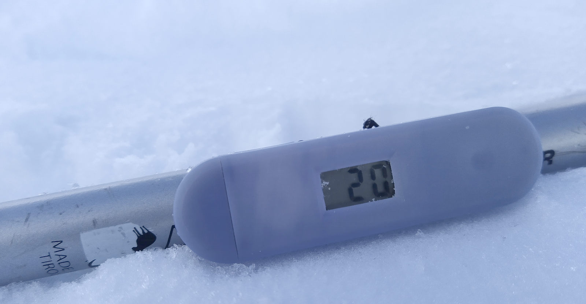

# Building a slope-sensor for ski mountaineering

The danger of avalanches is directly related to the slope. Measuring slopes
during ski touring helps getting a better feeling for the terrain, and thus,
avoiding dangerous routes. 

Since we were too stingy to spend 85 EUR on the [slope sensor by Pieps](https://www.pieps.com/produkt/30-plus-xt/), 
we rather spent 300 EUR on material and several weekends of our time to make our
own one. In this document, we lay out what we learned and provide instructions
how to build your own.  

## Choosing components

## Prototyping

## Programming the microcontroller

## CAD

## 3D-printing the case

## Final tests

## Conclusions

