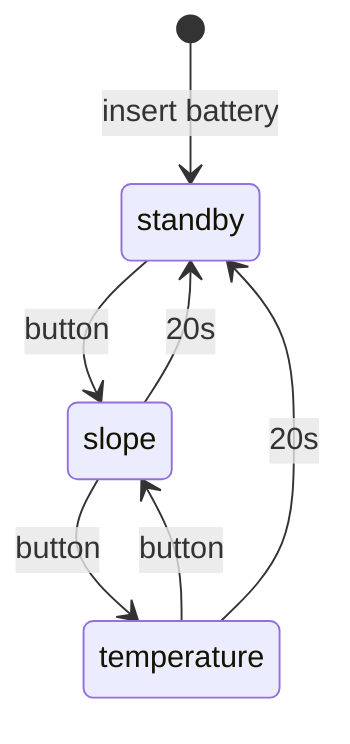

# Building a slope-sensor for ski mountaineering

The danger of avalanches is directly related to the slope. Measuring slopes
during ski touring helps getting a better feeling for the terrain, and thus,
avoiding dangerous routes. 

Since we were too stingy to spend 85 EUR on the [slope sensor by Pieps](https://www.pieps.com/produkt/30-plus-xt), 
we rather spent 300 EUR on material and several weekends of our time to make our
own one. In this document, we lay out what we learned and provide instructions
how to build your own. 

<!--
### Specification of the final product:
Weight: < 20g
Dimension: see CAD
Standby current: <300nA
Active current: <400µA
Estimated battery life: >10y in standby / >20k measurments

-->

## Choosing components
<!--
Component | Component no
----------|-------------
Microcontroller | https://www.digikey.at/en/products/detail/microchip-technology/ATTINY424-SSU/13415020
Accelerometer https://www.digikey.at/en/products/detail/memsic-inc/MC3632/15292805
LCD display https://www.tme.eu/at/details/de117-rs-20_7.5/digitale-lcd-displays/display-elektronik/de-117-rs-20-7-5-v/
Display driver https://www.digikey.at/en/products/detail/rohm-semiconductor/BU91796FS-ME2/12359485
PTC-resistor https://www.digikey.at/en/products/detail/texas-instruments/TMP6431DECR/11635694
Switch https://www.digikey.at/en/products/detail/c-k/PTS636-SK25F-SMTR-LFS/10071743
Battery holder https://www.digikey.at/en/products/detail/adam-tech/BH-127A-1/13537744
Capacitor https://www.digikey.at/en/products/detail/kemet/C0805C104M3RAC7800/2211748
Resistor 4k7 https://www.digikey.at/en/products/detail/stackpole-electronics-inc/RMCF0805FT4K70/1760659
Resistor 47k https://www.digikey.at/en/products/detail/stackpole-electronics-inc/RMCF0805FT47K0/1760299

Battery 
O-Ring
Screw
Rubber cord

--->

## Prototyping

## Programming the microcontroller

<!--
PCB connector https://www.digikey.at/en/products/detail/phoenix-contact/1893698/2553237
-->

## CAD

## 3D-printing the case

## Final tests

## Conclusions

