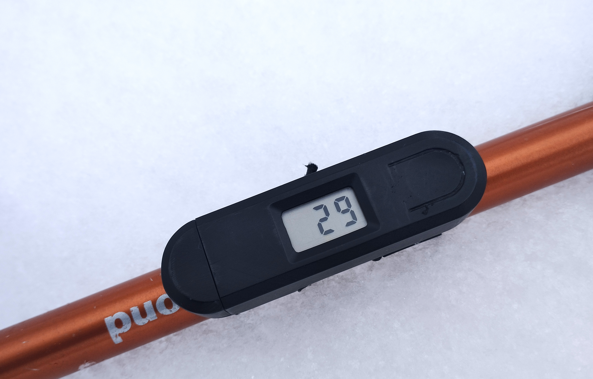

# Building a slope-sensor for ski mountaineering

The danger of avalanches is directly related to the slope. Measuring slopes
during ski touring helps getting a better feeling for the terrain, and thus,
avoiding dangerous routes. In addition, it can be a helpful argumentation aid to find out whether a face really has its >50° as stated in the guidebook or a rather more realistic 42°.

Since we were too stingy to spend 85 EUR on the [slope sensor by Pieps](https://www.pieps.com/produkt/30-plus-xt), 
we rather spent 300 EUR on material and several weekends of our time to make our
own one. In this document, we lay out what we learned and provide instructions
how to build your own. 

## Specification of the final product:
Our product showed the following specifications, which we measured: 
  
Weight: < 20g  
Dimension(LxWxT): 75x21.5x12  
Standby current: <300nA  
Active current: <400µA  
  
The estimated battery life is >10 years in standby or >20k measurements, whichever comes first.

## Operating principle
The product is designed to be mounted on a ski pole to ensure a more robust measurement of the slope. For this purpose, it has two rubber cords with which it can be attached to the ski pole. Pressing the button on the right side awakes the device from sleep-mode and displays the slope angle. Each subsequent press toggles between the slope-measurement-mode and the temperature-measurement-mode. 20 seconds after the last press of the button, the device automatically switches to sleep-mode.

## Choosing components
The first component to be selected was the display, because it governs the size of the device and its power consumption. We decided on a 7-segment LCD with 4 digits. The outer right digit is completely covered by the housing and electrically inaccessible. Of the outer left digit, only segment G is used to create a negative sign. To control the LCD, an LCD-driver is required that can address at least 15 segments. 

We chose a 3-axis accelerometer to measure the tilt angle. The accelerometer is aligned so that its X-axis is parallel to the pole axis. To obtain the tilt angle, the angle between the acceleration vector - which at rest corresponds to the gravity vector - and the X-component of the acceleration vector must be calculated.

  

$$\Theta_x = \arcsin{\Bigg(\frac{|\vec{G}_x|}{|\vec{G}|}\Bigg)}$$

An ATtiny424 microcontroller orchestrates communication with the components and performs the calculations. 

For the power supply a 3V lithium button cell is used. The size of the battery is chosen such that it just fits into the housing of the device. A CR-1225 is most suitable and can usually supply at least 40mAh.

The following table lists all the components used on the PCB.
No | Component | Specification | Quantity | Manufacturer Product Number
-|-|-|-|-
U1 | Microcontroller | [ATtiny424](https://www.digikey.at/en/products/detail/microchip-technology/ATTINY424-SSU/13415020) | 1 | ATTINY424-SSU
U2 | Accelerometer | [MC3632](https://www.digikey.at/en/products/detail/memsic-inc/MC3632/15292805) | 1 | MC3632
U3 | Display Driver | [BU91796](https://www.digikey.at/en/products/detail/rohm-semiconductor/BU91796FS-ME2/12359485) | 1 | BU91796FS-ME2
U4 | LCD | [DE117](https://www.tme.eu/at/details/de117-rs-20_7.5/digitale-lcd-displays/display-elektronik/de-117-rs-20-7-5-v) | 1 | DE 117-RS-20/7,5
TH1 | PTC-Resistor | [TMP64](https://www.digikey.at/en/products/detail/texas-instruments/TMP6431DECR/11635694) | 1 | TMP6431DECR
SW1 | Switch | [PTS636](https://www.digikey.at/en/products/detail/c-k/PTS636-SK25F-SMTR-LFS/10071743) | 1 | PTS636 SK25F SMTR LFS
BT1 | Battery Holder | [BH-127A-1](https://www.digikey.at/en/products/detail/adam-tech/BH-127A-1/13537744) | 1 | BH-127A-1
C1 | Capacitor | [100n](https://www.digikey.at/en/products/detail/kemet/C0805C104M3RAC7800/2211748) | 1 | C0805C104M3RAC7800
R1,R2 | Resistor | [4k7](https://www.digikey.at/en/products/detail/stackpole-electronics-inc/RMCF0805FT4K70/1760659) | 2 | RMCF0805FT4K70
R3 | Resistor | [47k](https://www.digikey.at/en/products/detail/stackpole-electronics-inc/RMCF0805FT47K0/1760299) | 1 | RMCF0805FT47K0

The following table lists all the other components used to build this slope sensor. A link to an example is also listed for each component.
Part | Specification
-|-
Connector | [ZEC 1,0/ 3-ST-3,5 C1 R1,3](https://www.digikey.at/en/products/detail/phoenix-contact/1893698/2553237)
Battery | [CR1225](https://www.conrad.at/de/p/gp-batteries-gppbl1225000-knopfzelle-cr-1225-lithium-62-mah-3-v-1-st-2446350.html)
O-Ring | [10.5 x 1.5](https://www.o-ring-stocks.eu/o-ring-10.5x1.5-nbr-nitrile-70-shore-a-black-ors113871)
Screw | [ISO 7050 - ST2,2 x 6,5 - A4-20H - C - H](https://online-schrauben.de/shop/Schrauben/Blechschrauben/DIN-7982-Form-CH-Senkkopf-Blechschrauben-mit-Phillips-Kreuzschlitz-und-Spitze-aehnl.-ISO-7050/Edelstahl-Rostfrei-A2/2,2-mm-Schraubendurchmesser)
Rubber cord | [2mm](https://www.amazon.de/perdix-Gummischnur-Gummikordel-Gummiband-Rucksack/dp/B0BB4V88YH/ref=sr_1_5?__mk_de_DE=%C3%85M%C3%85%C5%BD%C3%95%C3%91&crid=1S8HTQCSGRESL&keywords=gummischnur+2mm+schwarz&qid=1674239563&sprefix=gummischnur+2mm+schwar%2Caps%2C106&sr=8-5)

## Prototyping

## Programming the microcontroller

## CAD

## 3D-printing the case

## Final tests

## Conclusions

